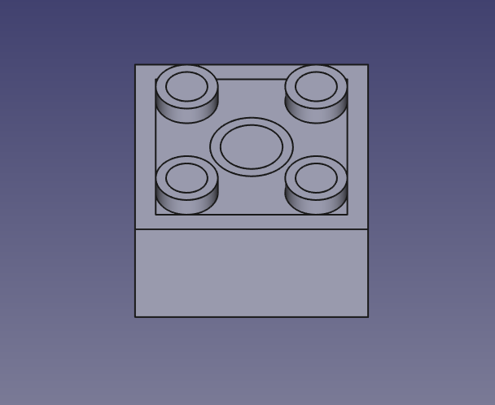
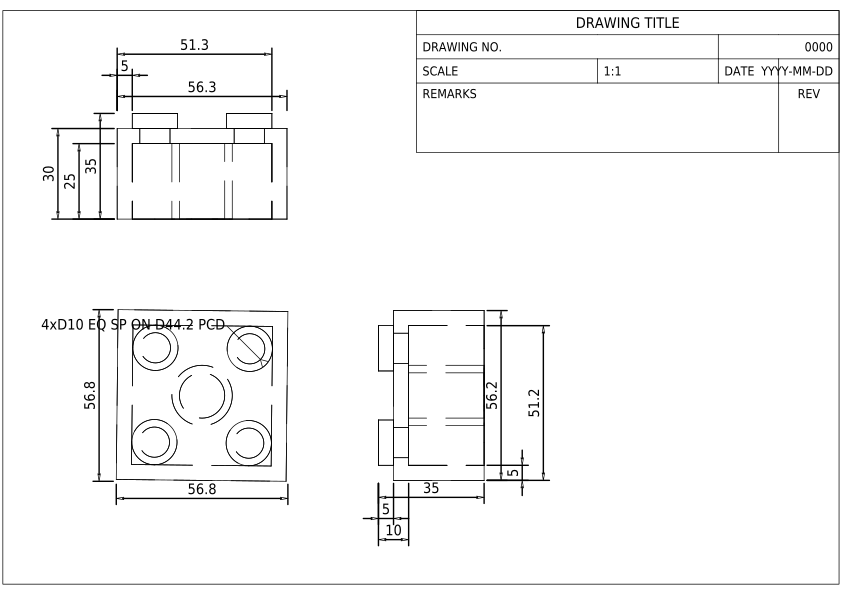

# 2D CAD Drawing generation from 3D CAD models

This tool is used to generate 2D CAD drawings from 3D CAD models.

## Installation

Install the package from PyPI:

```bash
pip install cad-3dto2d
```

Or install the package from the source code:

```bash
git clone https://github.com/neka-nat/cad-3dto2d.git
cd cad-3dto2d
uv sync
```

## Usage

```
python scripts/gen2d.py --step_file </path/to/step_file> --template A4_LandscapeParam --add_dimensions
```

## Demo

### Original 3D model (Flange)


### Generated 2D drawing (Flange)


### Original 3D model (Lego Block)


### Generated 2D drawing (Lego Block)

